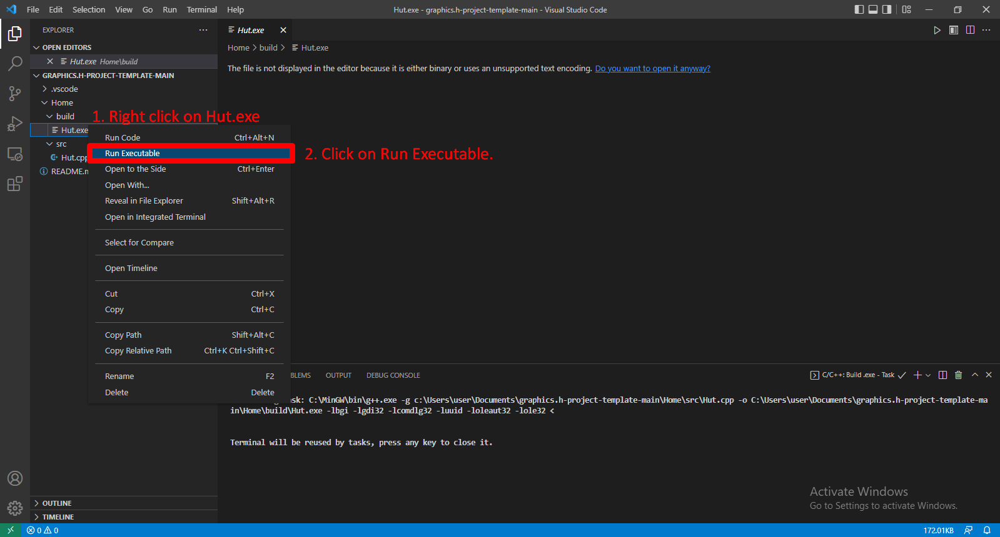

<h1 align="center"> How to Setup Graphics.h for Visual Studio Code</h1>

**Introduction**

Hi everyone, Today in this article we will see how to do graphical programming in Visual studio code using the Boreland Graphic interface's Graphic library.

In case of don't actually have to use Borland Graphic interface, and you just want to do modern graphic programming you better off using newer library and frameworks that are available.

like DirectX, OpenGL, SDL, SFML, Vulkan etc.

**Introduction to graphics.h**

The graphics.h header file is a library that provides simple graphics that make it possible to draw lines, rectangles, ellipses, arcs, polygons, images, circle and stars on a graphical window.

To use graphic.h we will have to initialize the graphics drivers on the computer using the initgraph function of graphic.h

**What is Visual Studio Code.**

Visual Studio code is lightweight source code-editor developed by Microsoft for Windows Linux and Mac OS. This is a source code editor that we can use to create our code in different programming languages and it also supports debugging get syntax highlighting and intelligence.

**STEP-BY-STEP INSTRUCTIONS.**

**Step 1: Download [Visual Studio Code](https://code.visualstudio.com/)**

First of all, click on the given link to open Visual Studio code’s website in your browser


Now download the setup according to your operating system, and then install visual studio code as you would install any other setup.

**Step 2: Download [MinGW](https://sourceforge.net/projects/mingw/files/latest/download)**

Click on the given link to open MinGW’s website in your browser


Now click download.

**Step 3: Install MinGW**

Now open minGW’s downloaded setup then click on Install and choose your directory where the software should be installed and click on continue.

After installing, you will see an image like below now you have to right click on highlighted (“mingw-32-base”, “mingw32-gcc-g++” and “mysys-base”) box and choose mark for installation.


After checking the checkboxes you should see something like the image,
now click on Installation on the top left corner and then click on apply changes.

you should see something like shown in the image above.


And then click on Apply.

After installation is complete, you should see something like this


Then click close to close the installer.

**Step 4: Copy MinGW/Bin Path**

Now open 'This PC' and then open 'local Disk C' you will see a folder named minGW open that folder and then open the folder named bin.


Now you have to copy the folder path which is on the top of the page in address bar as shown above in the picture.

Then right click and copy or just press 'Ctrl + C' on your keyboard.

**Step 5: Environment Variables**

Now from your start menu open 'Control Panel' and click on System. If you don't find system on your control panel then type 'environment variable' on search bar which will show edit system environment in then you have to click on it.

As shown in the picture below


Now you have to right click on Advanced System Settings, you should see System Properties then you have click on Environment Variables.


Then click on the path in system variable and click on edit as shown in the image above,
then click on new and paste the bin path that we have copied in the previous step and then click Ok.

Now click on OK until no pop up remains.

**Step 6: Let's see if MinGW is installed successfully or not**

press 'Win + R' on your keyboard and now type cmd then press enter then command prompt will open in front of you


Now you have to type gcc --version in command prompt and press enter if you see something like the image above, then your minGW setup has been installed successfully.

If you get some error don't worry just reinstall minGW as shown in the step 2 and step 3 and it should solve the problem.

**Step 7: Download [Solution-to-graphics.h](https://github.com/ullaskunder3/Solution-to-graphics.h)**

To setup "graphics.h" in Visual Studio Code, download the zip file linked above to get all the required files.

extract the downloaded file, there will be three important files:

- graphics.h
- winbgim.h
- libbgi.a

copy graphics.h and winbgim.h files then paste into MinGW/include folder, as shown in the image below.

path might be ("C:\MinGW\include")


copy libbgi.a file then paste into MinGW/lib folder, as shown in the image below.

path might be ("C:\MinGW\lib")


**Step 8: Download [graphics.h-project-template](https://github.com/ullaskunder3/graphics.h-project-template)**

download zip file from above link and then extract the downloaded file, now you can paste the extracted folder wherever you want and rename the folder name, as shown in the image below.


Now open copied folder and right click then choose open with code then your workspace will open in the visual studio code then trust the author to continue, as shown in the image below.


Then the folder of your workspace will open in front of you, as shown in the image below.


Now let's talk about src, build and .vscode. How these three folders do works?

- Src : folder src contains source code files.
- Build : folder build where compiled .exe file will be stored.
- .vscode (DO NOT MODIFY ANYTHING IN THIS FOLDER) : .vscode includes c/cpp_properties.json and task.json that are required for compiling your computer graphics source code using graphics library.

**Step 9: Download required extensions for visual studio code**

Once visual studio code is installed, now we need some extensions so let's install.

click on the extension button then click on C/C++ extension from Microsoft as shown in the below image. You can search them up if it is not recommended.

then comes the second extension, Named “code runner”. install “code runner” extension by searching it up in visual studio code marketplace, as shown in the image below.

then the last extension comes our “exe runner”, for this, you have to search for “exe runner” in the search box of extensions and then install, as shown in the image below.


restart visual studio code after all three extensions have been installed, now we have successfully setup visual studio code for graphics programming.

**Step 10: Now go to src folder and click on Hut.cpp and open the file**
```cpp
#include <stdio.h>
#include <stdlib.h>
#include <conio.h>
#include <graphics.h>
int main()
{
    int gm, x, y, gd = DETECT, i;
    // int midx, midy;
    int stangle = 45, endangle = 50;
    int radius = 50;
    
    char data[] = "C:\\MinGW\\lib\\libbgi.a"; //static file

    initgraph(&gd, &gm, data);
    x = getmaxx(); // to get the co-ordinates i.e. x & y
    y = getmaxy();
    cleardevice();
    line(200, 150, 350, 150);
    line(140, 200, 200, 150);
    line(140, 330, 140, 200);
    line(250, 200, 140, 200);
    line(200, 150, 250, 200);
    circle(196, 180, 15);
    setfillstyle(2, 14);
    floodfill(196, 180, 15);
    setfillstyle(1, 2);
    line(350, 150, 400, 200);
    floodfill(210, 180, 15);
    line(400, 200, 400, 330);
    line(140, 330, 400, 330);
    line(250, 200, 250, 330);
    line(250, 200, 400, 200); // Hut

    setfillstyle(5, 7);
    floodfill(260, 180, 15);
    line(170, 260, 170, 330);
    line(170, 260, 210, 260);
    setfillstyle(10, 9);
    floodfill(180, 250, 15);
    line(210, 260, 210, 330);
    setfillstyle(9, 9);
    floodfill(210, 250, 15);
    line(290, 110, 290, 150);
    line(310, 110, 310, 150);
    ellipse(300, 110, 0, 360, 10, 3); // Chemney

    setfillstyle(6, 8);
    floodfill(300, 120, 15);
    line(300, 250, 350, 250);
    line(300, 280, 350, 280);
    line(300, 250, 350, 280);
    line(300, 280, 300, 250);
    line(350, 280, 350, 250);

    setfillstyle(9, 9);
    floodfill(252, 300, 15);
    setfillstyle(8, 9);
    floodfill(342, 270, 15);

    setcolor(3);
    /* draw arc */
    arc(30, 300, stangle, endangle, radius);

    setcolor(7);
    line(5, 330, 600, 330);
    for (i = 0; i < 650; i = i + 10)
    {
        setcolor(4);
        settextstyle(7, 0, 5);

        char stringData1[] = "Home Sweet Home";

        outtextxy(0 + i, 390, stringData1);
        delay(100);
        setcolor(0);
        settextstyle(7, 0, 5);

        outtextxy(0 + i, 390, stringData1);
    }
    getch();
    closegraph();

    return 0;
}
```

**Step 11: Now build and run the Code**

To build from source code using/including graphics library, press “Ctrl+Shift+B”  to run the build task you will get the executable file in build folder which will have same name as our source code file but with an extension of “.exe”, as shown in the image below.


now you will see the hut.exe file inside the build folder, you have to right click on this then click on run executable, as shown in the image below.



Now your program will run and you will see a hut on the console that appears, as shown in the image below.


now whenever you need to write a new code, just create a new file in src folder and write your source code in it the and build and run it just like we did for hut.cpp and hut.exe.

**CONCLUSION**

In the following article, we have seen how can we setup visual studio code for graphical programming using the Boreland Graphic Interface graphic library.

This should be done only in the case that you have to specifically use graphic.h, otherwise you are better off using new library and frameworks like SDL or SFML etc.

So i hope this article was of help to you, Please share it with you friends, collegue and peers.
